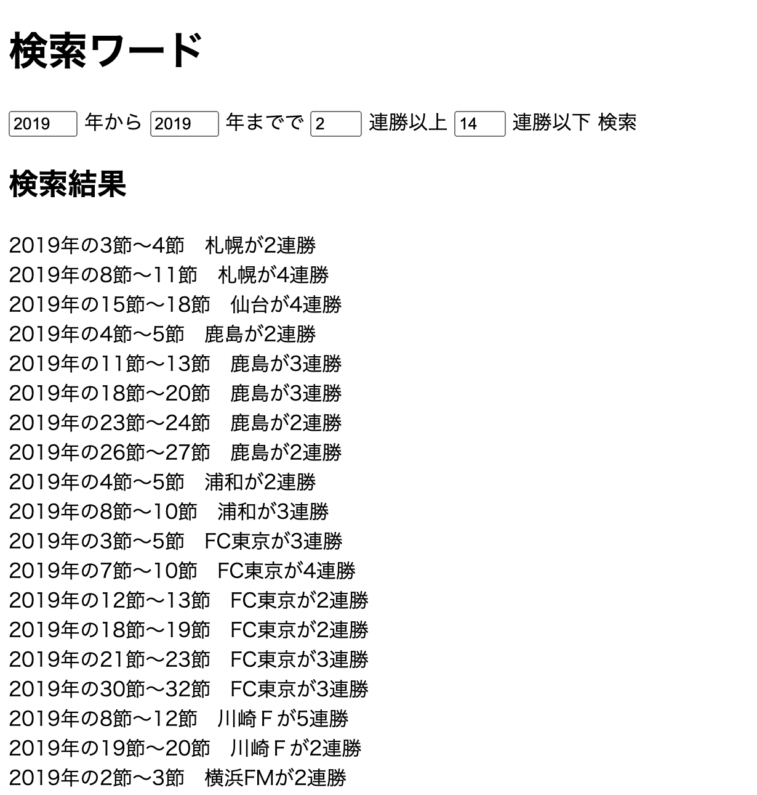
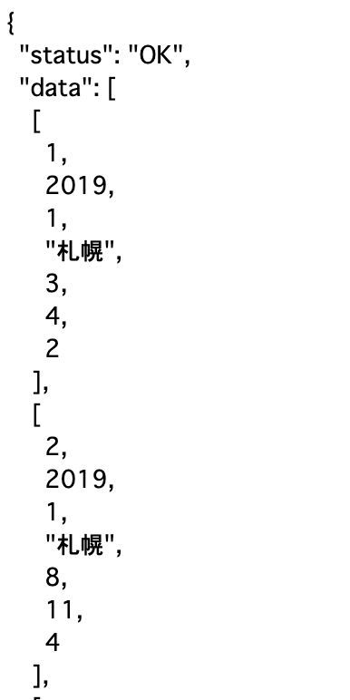

# J検索くんAPI
- サッカーJリーグのデータを[フロント側](https://github.com/yuta97/j-search-front)に渡す、WebAPIです。
- [こちらから検索サイトに飛べます](http://j-search.s3-website-ap-northeast-1.amazonaws.com/)
- フロントの検索画面

- APIの画像

<!-- 画像がずれてるので配置とサイズ修正 -->

# アピールポイント
- スクレイピング 
- Dockerを使い、環境構築が簡単に
- API化することでフロントとバックエンドを分けて開発
# 全体の構成・使用技術・ライブラリなど
## ディレクトリ構成

```
src
 ├── app.py　(apiを作成)
 ├── create_result.py (サイトをスクレイピングして、DB作成)
 ├── create_teamid.py (teamidのDB作成)
 ├── dbconect.py (DBとの接続設定)
 ├── docker-compose.yaml
 ├── Dockerfile
 ├── requirements.txt
 
```

## 使用技術
- Python (ライブラリにFlask)
- Docker 
- MySQL
## ライブラリ
- flask　（APIのため）
- flask-cors　（CROS対策）
- mysql-connector-python (MySQLとの接続)
- beautifulsoup4　（スクレイピング）
- requests　（スクレイピング）

# 使い方
rootディレクトリで
```
$ docker-compose up --build -d
```
これで環境構築され、DB作成とAPIサーバーが起動する
<!-- # 注意・補足 -->

# 作成者
増井　悠太